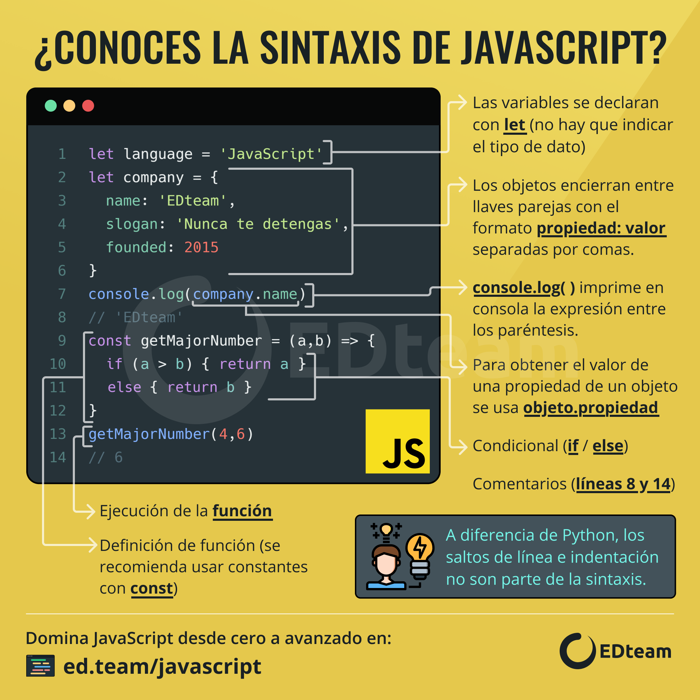
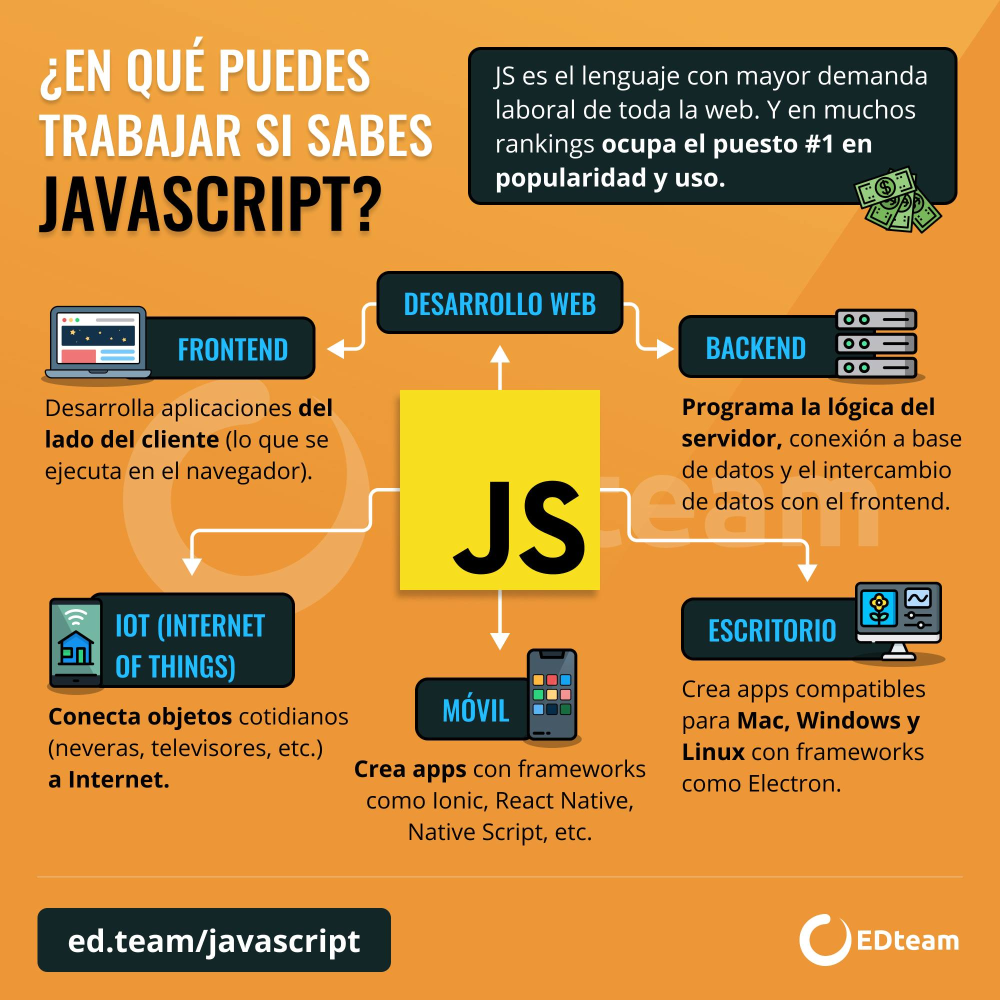
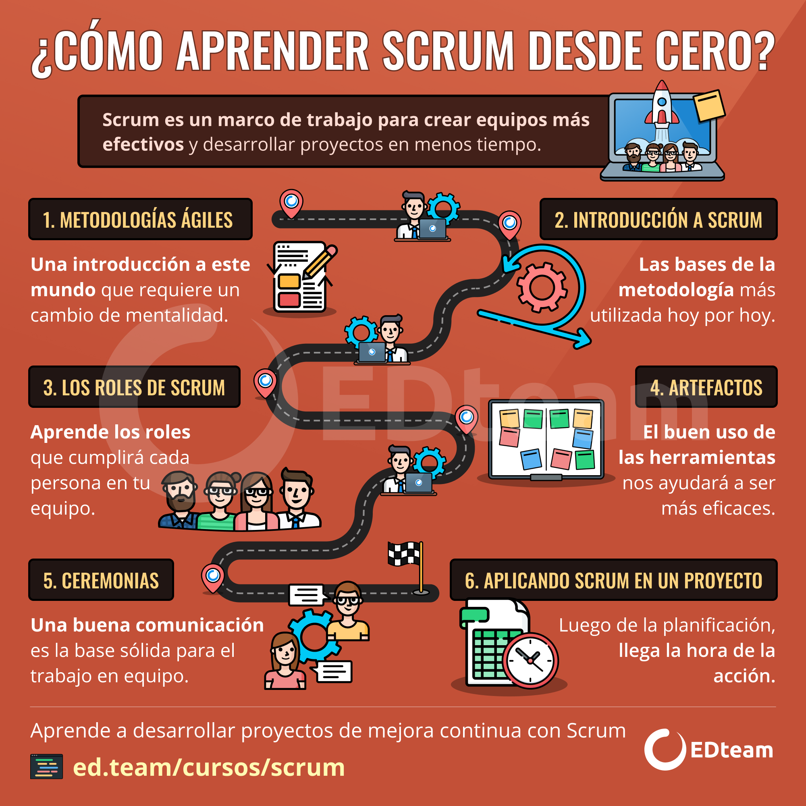
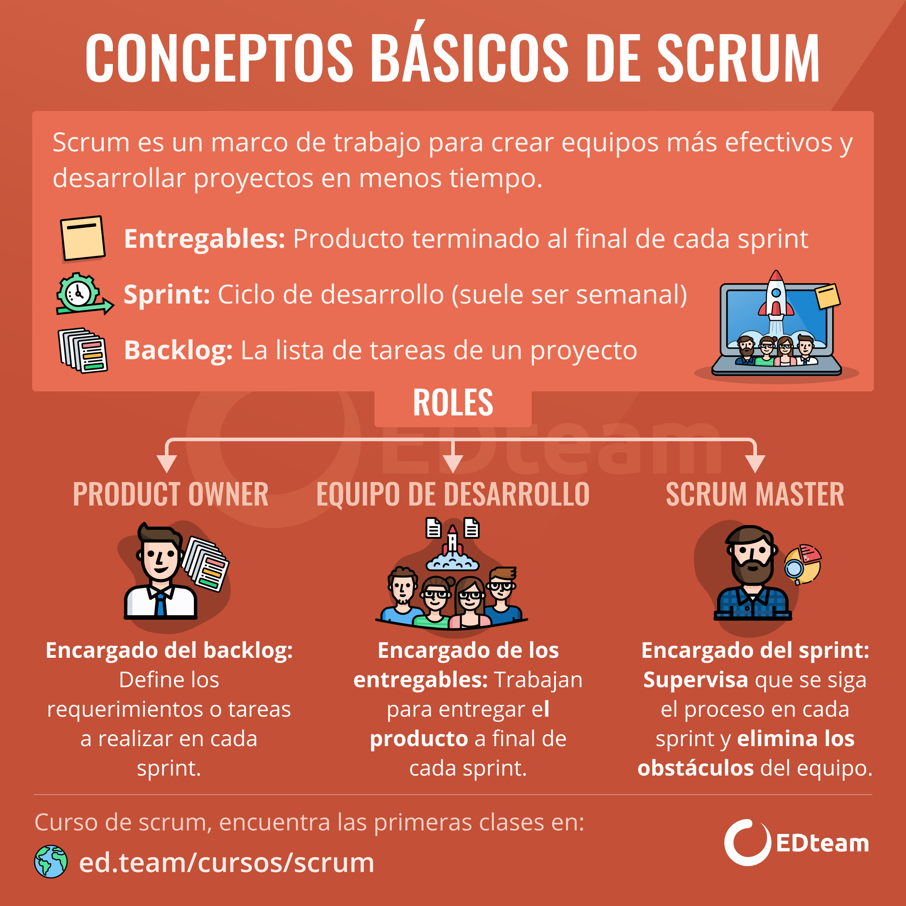

# Tienda de Galletas - JS con _SPA_ y enfoque _SCRUM_

Proyecto en equipo para aprender *JS* y profundizar sus conceptos.

## **Temario y clases:**
- #### Fundamentos de JS.
- #### Manejo del DOM con JS.
- #### Programación asíncrona y AJAX con JS.
- #### Single Page Applications(SPAs).

___

## Ruta de aprendizaje JS:  [Ruta Jon mircha](https://aprendejavascript.org)


## Backend Simulado:
Usaremos [Json Server](https://www.npmjs.com/package/json-server) que nos permite crear una API REST simulada que nos permite realizar peticiones _GET,POST PUT y DELETE_.

### Para instalar **Json server** debemos hacer lo siguiente:
1. Ejecutar el siguiente comando para crear el archivo de dependencias `package.json` pero por defecto:
```npm init -y```

2. Ejecutar el siguiente comando para instalar **Json server** como dependencia:
```npm i json-server```

3. Crear el archivo `db.json` con la data de los productos, sabores y cualquier otra data que necesitemos

4. Crear de script del `package.json` agregar el siguiente comando para levantar el servidor de **Json Server**:
```"start": "json server --watch db.json"```

5. Ejecutar en consola el siguiente comando para levantar nuestro backend y crear los endpoints a consumir:
```npm run start```
___

## Estructura de carpetas y archivos:

| Carpeta / Archivo | Funcionalidad | 
| --------- | ---------   | 
| `/app`                  | Contiene todos los archivos importantes de la aplicación.        
| `/app/assets`           | Contiene todos los recursos estáticos como _imágenes_, _SVG_, _videos_, etc.      
| `/app/components`       | Contiene todos los componentes _Javascript_ de la app.       
| `/app/pages`       | Contiene todas las paginas de la app.       
| `/app/helpers`          | Contiene todas las _funciones reutilizables_ de ayuda en nuestra lógica y _constantes_ que se usan en la app(ej. formatear una fecha, formatear numero a peso de venta,funcion para peticiones http, etc). Se recomienda los archivos helpers con la siguiente nomenclatura: `archivoHelper.js`. Por ejemplo puede ser `formatsHelper.js` 
| `/app/functions`       | Contiene todas las funciones que tendran la logica de las funcionalidades de nuestra página(ej. logica del carrito, ,menu hamburguesa, etc).        
| `/app/Router.js` | Maneja la lógica al cambiar el _hash_ de la url y carga la data de APIs, archivos persistentes, etc (En nuestro caso controla la carga de la pagina de incio, tienda,sobre mí, contacto, etc).       
| `App.js`                | Se encarga de renderizar los _componentes_ de la app y tambien el _Router_.       
| `index.html`            | Único archivo _HTML_ donde carga todo el contenido de una vez con todos los recursos y el JS        
| `index.js`              | Archivo que se encarga de renderizar el contenido de la _SPA_ de una sola vez y cada vez que cambia el _hash_ de la url.        
| `db.json`            | JSON de **JSON server** que tendrá toda la data de productos, entre otros y creará nuestros _endpoints_.        
| `/node_modules`         | Carpeta que guarda las dependecias instaladas con _NPM_.         
| `package.json`          | Archivo de configuración de dependencias de _NodeJS_.
| `.gitignore`            | Establece carpetas o archivos que son de desarrollo y no tendrán seguimiento con _Git_.        

___


## Extensiones y configuraciones recomendables para trabajar con SPA:
- #### Instalar plugin de VSC llamado *es6-string-html* que permite colorear los string de HTML en JS.
- #### Instalar plugin de VSC llamado *Template String Converter* que permite convertir las comillas a backticks al crear un _template string_.
- #### Configurar _Emmet_ en JS para escribir el código HTML más rápido en los strings. Lo anterior se hace yendo a configuraciones escribiendo _"Emmet Include Languages"_ y en items ponemos _"javascript"_ en su value _"html"_


## Blogs recomendables para leer:
- #### [ECMAScript](https://jonmircha.com/ecmascript)
- #### [DOM](https://jonmircha.com/dom)
- #### [Asincronía en JS](https://jonmircha.com/javascript-asincrono)
- #### [JSON](https://jonmircha.com/json)
- #### [AJAX](https://jonmircha.com/ajax)
- #### [API REST](https://jonmircha.com/api-rest)
- #### [SPA](https://jonmircha.com/spa)
- #### [Fundamentos NodeJS](https://jonmircha.com/nodejs)

## Infografías útiles para el aprendizaje:

### Sintaxis JS:


### Ruta aprendizaje JS:


### Tipos de datos primitivos JS:


### Campo laboral JS:



### Ruta aprendizaje SCRUM:


### Conceptos SCRUM:


