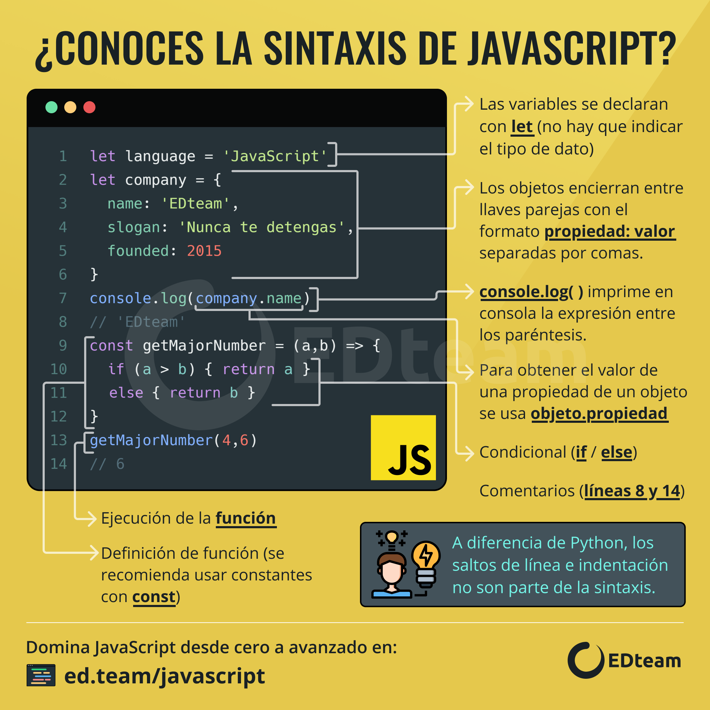
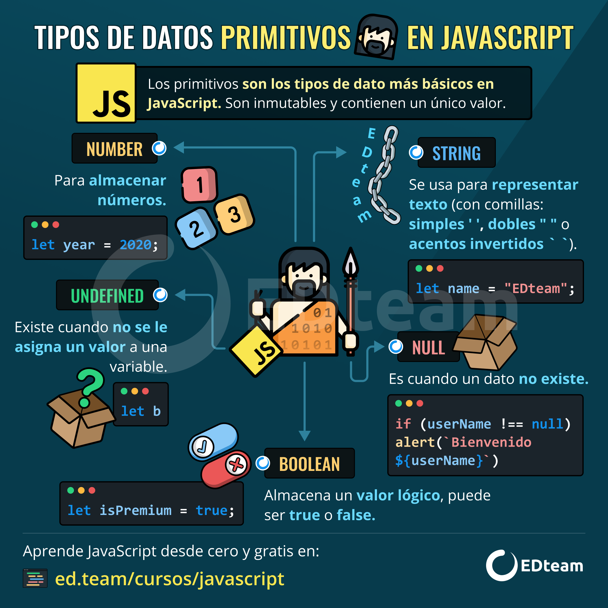
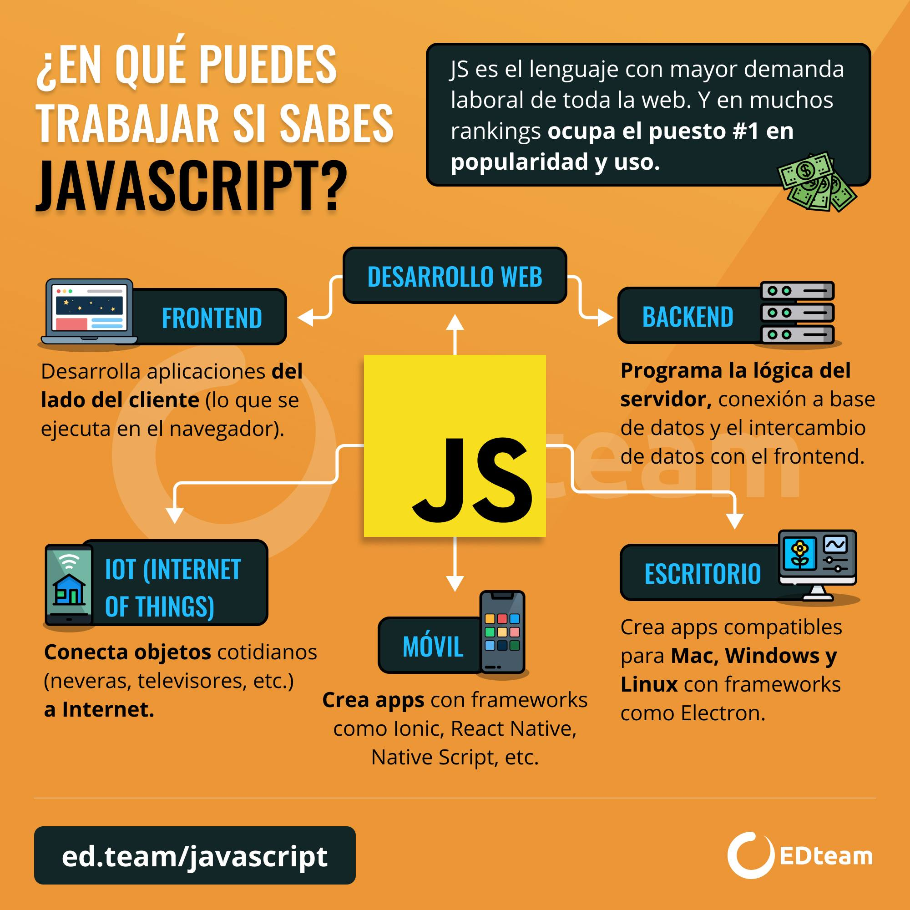
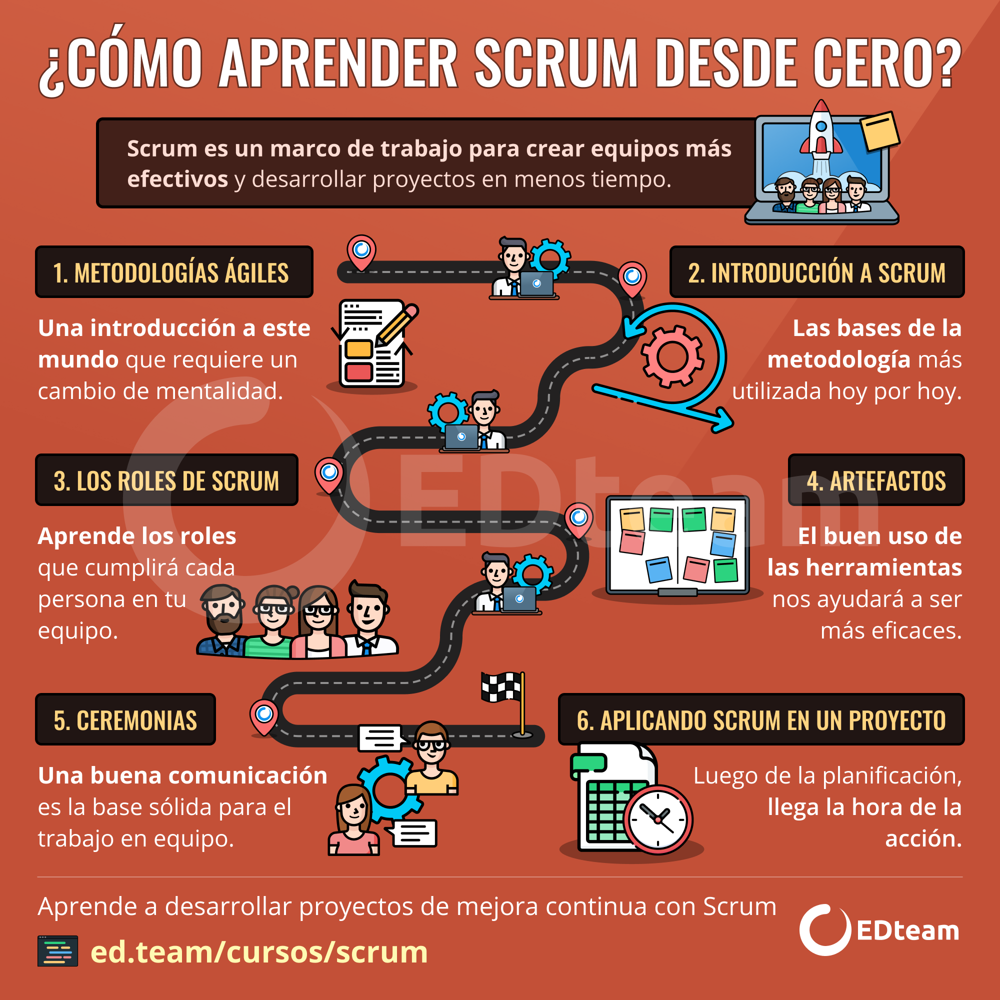

# Tienda de Galletas - JS

Proyecto en equipo para aprender *JS* y profundizar sus conceptos.

## **Temario y clases:**
- #### Fundamentos de JS.
- ### Manejo del DOM con JS.
- ### Programación asíncrona y AJAX con JS.
- ### Single Page Applications(SPAs).

___

## Ruta de aprendizaje JS: [Jon mircha](aprendejavascript.org)

## Infografías útiles para el aprendizaje:

### Sintaxis JS:

### Ruta aprendizaje JS:

### Tipos de datos primitivos JS:

### Campo laboral JS:

### Ruta aprendizaje SCRUM:

### Conceptos SCRUM:

### JS:
