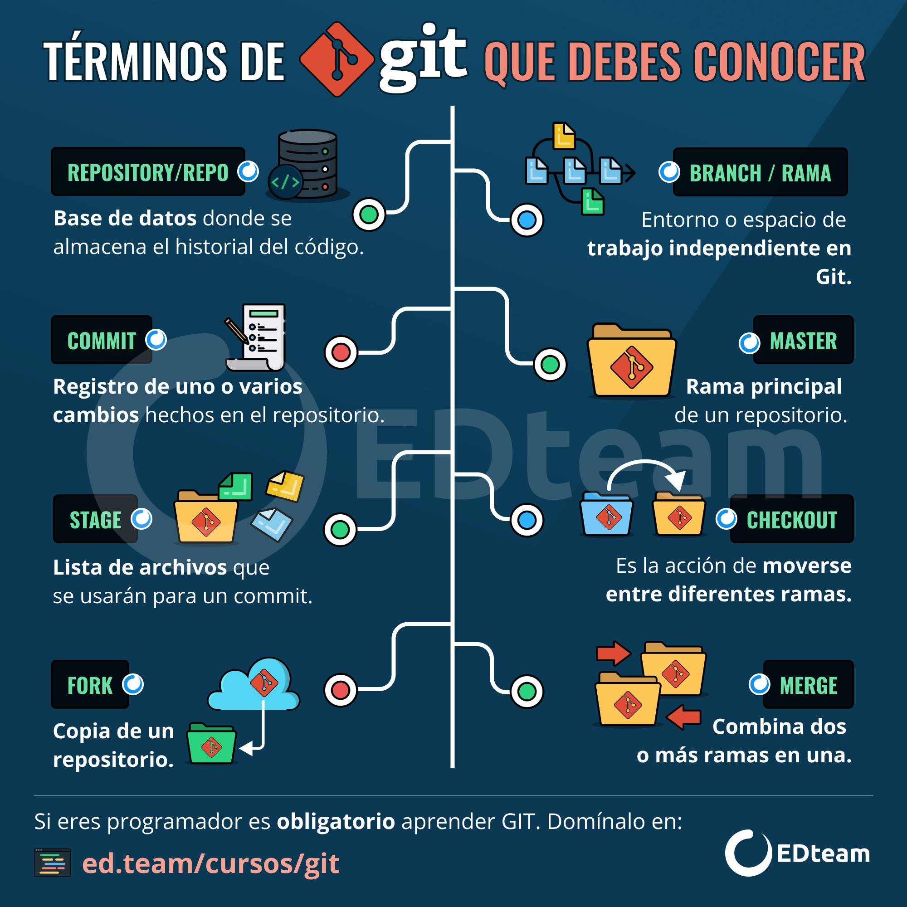

# Tienda de Galletas - HTML y CSS

Proyecto en equipo para aprender **HTML**, **CSS**, **GIT** y **Responsive Web Design** usando un _Layout_ (diseño) de ejemplo.

**_Layout de proyecto_**: [Layout de Wix](https://www.wix.com/website-template/view/html/2007?utm_content=bufferc539f&utm_medium=social&utm_source=pinterest.com&utm_campaign=buffer&epik=dj0yJnU9Y1hjUDZ6NmNpYjg2RXdjTUMtMEphTE00NXRidjNIUS0mcD0wJm49NlZKeHRUblcwd19wWHp5QjZWS1FyZyZ0PUFBQUFBR1dmVFh3)

## **Temario y clases:**
- #### Clase introductoria de _Git_ para trabajar el _Layout_ de ejemplo en equipo y para que el código escrito quede respaldado.

- #### Crear las páginas con _HTML_ y _CSS_ en equipo de a 2 aclarando dudas de conceptos de las tecnologías mencionadas anteriormente.

- #### Aplicar **_Responsive Web Design_** a las páginas usando un enfoque **_Mobile First_** (diseño pensado para dispositivos más pequeño hasta los más grandes). Si es necesario realiceremos una clase de **_Responsive Web Design_** 

## **Recursos que usará el proyecto:**
- [Bootstrap Icons](https://icons.getbootstrap.com/?q=yout) para poder utilizar iconos.
- [Google Fonts](https://fonts.google.com/specimen/Raleway?query=Rale) para usar una familia de fuentes(en este caso usaremos _Raleway_)

## Tips y requisitos para trabajar en el proyecto
En esta sección listaré las instalaciones necesarios y programas que se necesitan para trabajar en el proyecto, además mencionaré unos tips.

### Instalaciones necesarias:
- #### Editor _[Visual Studio Code](https://code.visualstudio.com/Download)_.
- #### Instalar runtime(entorno de ejecución) _[Node.js](https://nodejs.org/en) (recomendable instalar la versión LTS)_.
- #### Instalar el controlador de versiones _[Git](https://www.git-scm.com/downloads)_.
- #### Instalar en _VSC_ el plugin *_Live server_* para correr servidor local de nuestro proyecto.
- #### Instalar en _VSC_ el plugin *_GitLens_* para ver de una forma gráfica el flujo de _Git_.

___

### Tips:

#### Tips plugins de _VSC_ a utilizar:
- Recomendable instalar en _VSC_ el plugin _Prettier_ para formatear código _HTML_ y _CSS_, así ordenando los archivos.
- Recomendable instalar en _VSC_ el plugin _Better Comments_ para ver los comentario coloreados en _HTML_ y _CSS_.
- Recomendable instalar en _VSC_ el plugin _Live Preview_ para visualizar nuestra web en el mismo editor de código, así viendo nuestro diseño en móvil.

#### Tips para ser más productivo escribiendo código:
- Recomendable usar [Emmet](https://emmet.io/) que es un plugin que viene por defecto en _VSC_ para escribir código _HTML_ más rápido y ser más productivo.

  #### **Infografía con tips de _Emmet_:**
  - 

- Usar atajos de teclado de _VSC_ para manejar el código más rápido(como clonar líneas de código, seleccionar múltiples líneas de código, comentar y descomentar código, etc).

  #### **Atajos d teclado VSC:** 
  - [Atajos windows](./assets/tips/keyboard-shortcuts-windows.pdf)

- Recomendable usar la métodología BEM (Block Element Modifier) para definir clases en HTML y así tener un código más escalable y fácil de leer.

  #### **Ejemplo de BEM:**
  - 

___

## Infografías útiles para el aprendizaje:

### Ruta de aprendizaje de HTML:
- Fundamentos (etiquetas de texto, listas, enlaces, tablas, imágenes, formularios, etc)

- Aprende sobre semántica HTML (aprender a usar etiquetas como: section, article, header, aside, footer, address, nav, etc).

- Rendimiento con HTML (lazy loading, meta-etiquetas para el rendimiento, saber cuándo cargar una imagen en distintos formatos como JPG, WEBP, saber cómo importar y en qué orden scripts, etc).

- SEO con HTML(meta etiquetas y etiquetas de SEO, etc).

- Accesibilidad con HTML(atributos HTML para la Accesibilidad).

  **Curso:** [Fundamentos HTML](https://youtu.be/-oK6zL01fNM?si=E7YGOCTfUEgceL35)

___

### Ruta de aprendizaje de CSS:
- **Fundamentos:** (Modelo de caja, entender los pilares o el algoritmo de CSS que son la especificidad, la herencia y la cascada, tipos de selectores, pseudo-clases, pseudo-elementos, prefijos para soporte en los navegadores, dimensionamientos width y height, overflow, posicionamientos, diferenciar los elementos en línea con los de bloque, etc)

  **Curso:** [Fundamentos CSS](https://youtu.be/K3xmRF8ab1o?si=aAHlTNtjFYbag9EU)

- **Unidades y estilos CSS:** colores usando sistema hexadecimal, RGB, HSL y valores como transparent y currentColor, opacidad, unidades de medidas absolutas y relativas como pixeles, ems, rems, porcentajes, EXs, CHs y viewport units, variables CSS, funciones como url(), calc(), min(), max(), clamp(), etc. saber cargar fuentes externas o locales desde CSS, y por último estilos de texto, estilos de fondo, estilos de imagenes, estilos de listas y estilos de formulario.

  **Curso:** [Unidades y estilos CSS](https://youtu.be/p_lT7AgpEMU?si=F6eKDc0WWbvqoi62)

- **Flexbox:** Diseños flexibles usando _flexbox_, entender el direccionamiento en columna y filas, etc.

  **Curso:** [CSS Flexbox](https://youtube.com/playlist?list=PLvq-jIkSeTUbQc3dGsssp8lxAi5npMrys&si=_Ise6tSMH020DiNC)

- **Grid:**  Diseños con grillas usando Grid, entender el sistema de grillas, etc.

  **Curso:** [CSS Grid](https://youtube.com/playlist?list=PLvq-jIkSeTUY628cyd9LVbXSXi2xG9mUl&si=Czz0NVoB1iRfh5fG)

- **Efectos visuales y movimientos CSS:** sombras de caja y texto, degradados lineales, radiales y cónicos, filtros, mascaras, formas, modos de mezcla, efectos de scroll, transiciones, transformaciones, animaciones, perspectiva 3D, etc.

  **Curso:** [Efectos visuales y movimientos CSS](https://youtu.be/mVhoGXkDbMw?si=eNM_w-e11kiSrvvU)

- **Responsive design y arquitectura CSS:** Contenedores flexibles, tamaños máximos y mínimos con min-height, max-height, min-width y max-height, multimedia flexible, media queries, breakpoints, entender que es el viewport, Feature queries, container queries, desktop first VS Mobile first, saber estrategias de diseño multidispositivos como responsive web design que todos conocemos, adaptive design, responsive + RESS, responsible responsive design y fluid design. Por último entender sobre arquitectura CSS usando algunas metodologías como BEM, SMACSS, OOCSS, ITCSS, Atomic design, etc.

  **Curso:** [Responsive design y arquitectura CSS](https://youtu.be/udGrXWeJp1Y?si=CU8GmY6hdouU_YTl)

___

### Pasos para crear el Frontend de una web:

___

### ¿Que es Git?

### Terminos de git que debes conocer:

### Como trabajar en equipo con Git:

### Comandos de git:

### Tip para mensajes de un commit:

### Tip para ver historial de commits:

